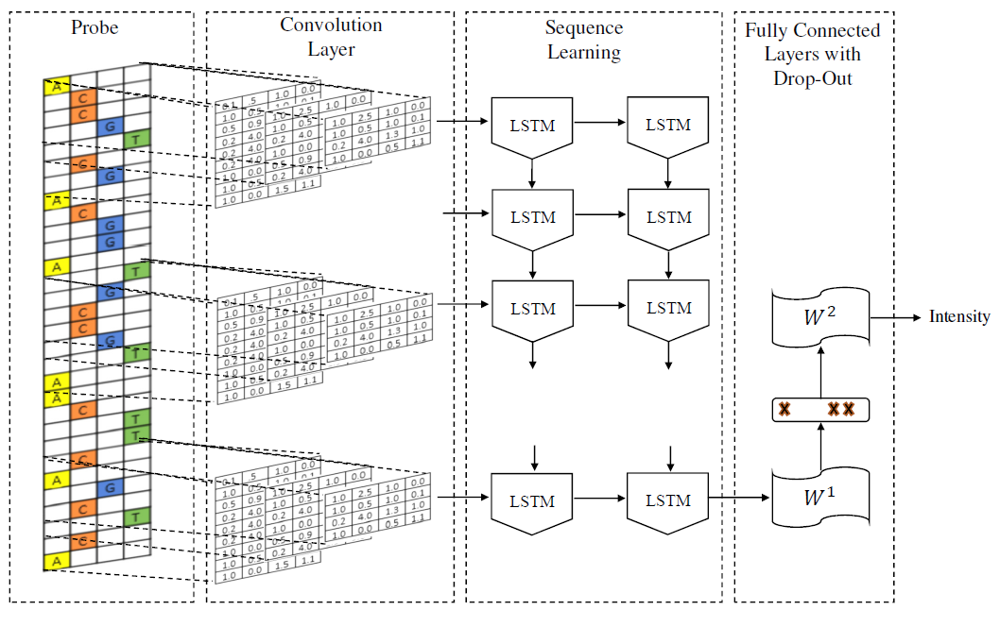

# DeeperBind: Enhancing Prediction of Sequence Specificities of DNA Binding Proteins
DeeperBind is an extension of [DeepBind](http://www.nature.com/nbt/journal/v33/n8/full/nbt.3300.html) which adds a layer of Deep LSTM to model positional information. DeeperBind is deisgned to predict protein-DNA binding affinity from high-throughput assays that measure the binding affinity.

##Architecture
We used Deep Convolutional Neural Network to chracterize multiple motifs and the long-short term memory networks to capture temporal (i.e. positional) features on the probe sequences. DeeperBind has been successfully tested on [Proteim Binding Microarray (PBM)](http://the_brain.bwh.harvard.edu/pbm.html) data but can readily be extended to other data such as chip-seq. For more information, please refer to [this article](http://ieeexplore.ieee.org/document/7822515/).

##References
[1] 1.	Hassanzadeh, Hamid Reza, and May D. Wang. "DeeperBind: Enhancing Prediction of Sequence Specificities of DNA Binding Proteins." Bioinformatics and Biomedicine (BIBM), 2016 IEEE International Conference on. IEEE, 2016.